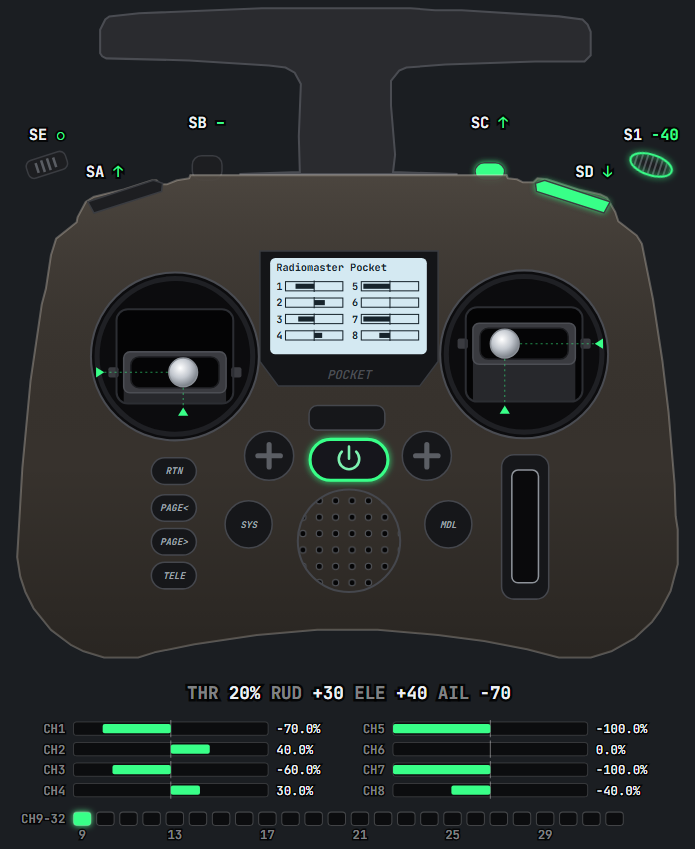

# Pocket Overlay

Show your RadioMaster Pocket's sticks and switches live on stream.

## Setup

1. **[Download](https://github.com/themixednuts/pocket-overlay/releases/latest)** the file for your computer and unzip it.
2. **Plug in** the Pocket and pick **USB Joystick (HID)** on the radio.
3. **Open** `pocket-overlay`. Its settings page opens in your browser.
4. Click **Copy URL** there. In OBS, add a **Browser** source with that URL and the size shown next to it.

Keep `pocket-overlay` open while you stream. Open it again to get back to its settings.

## Help

- **The wrong thing moves:** click **Detect channels** on the settings page.
- **OBS shows nothing:** open `pocket-overlay` before OBS, or refresh the source.
- **OBS is on another PC:** run `pocket-overlay` on the PC the radio is plugged into, switch on **Other PC** next to the OBS URL, and use the URL it shows. Allow it if Windows asks.
- **Windows warns you:** click **More info**, then **Run anyway**.
- **Mac won't open it:** go to System Settings → Privacy & Security and click **Open Anyway**.
- **Linux:** allow access once with `sudo cp 99-radiomaster-pocket.rules /etc/udev/rules.d/`, then replug the radio.

More options, and how it works: [DEVELOPING.md](DEVELOPING.md).
